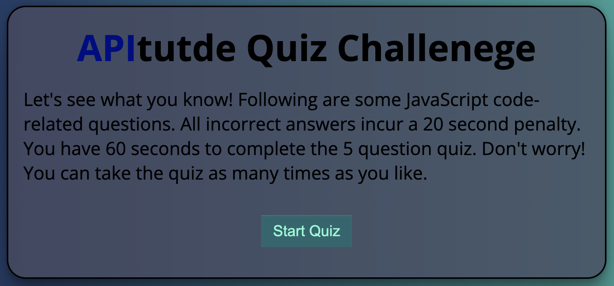
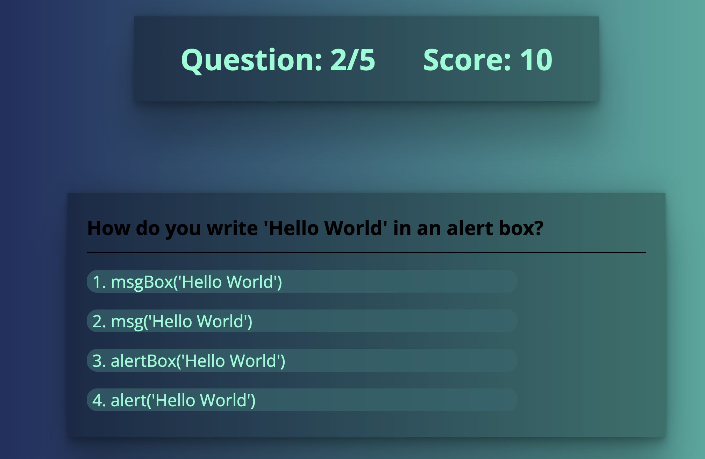
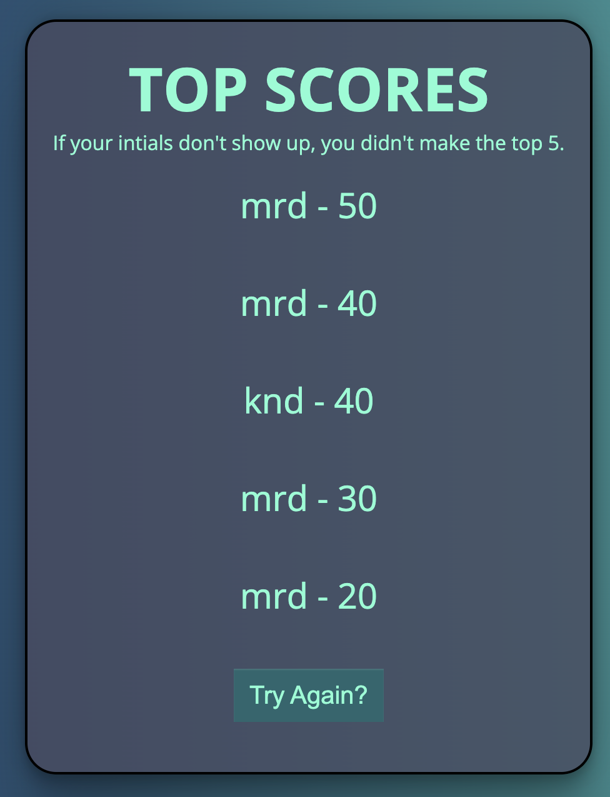

# apitude-code-quiz

---

Rice University Bootcamp - Web API Code Quiz

---

---

## Description

This weeks challenge was to design a quiz that produces questions and tallys up a high score, then saves that score to localStorage for permanence.

The main focus was to:

1. Set a timer and incur time penalties based on wrong answers.
2. Update the score as the game continues.
3. Set and Get items from localStorage.
4. Display top scores once the game is finished.

I added many hovers and shadows to give my quiz dimensionality, instead of a flat page that isn't interesting to look at. The main quiz section of the application still holds focus for the user.

I created a heads up display to let the user know which question they're on, and what their current score is. There is also a timer function that counts down.

---

Mobile size:

My application scales nicely for mobile devices.

---

## Challenges

My biggest challenge was getting the timer to start and stop based on certain clicks, as well as having the top scores page load correctly.

---

# https://mrdekraker.github.io/apitude-code-quiz/

## Credits

Flexbox tutorials -

1. Wes Bos: https://flexbox.io/
2. css-tricks: https://css-tricks.com/snippets/css/a-guide-to-flexbox/

## License

Please refer to the LICENSE in the repo.
